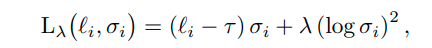

## Michael Villarreal

Hello! My name is Michael Villarreal, and I am Computer Science PhD student at the University of Memphis. While I do have a variety of different interests, I focus mainly on machine learning and AI. My area of research right now is within the computer vision realm of machine learning as it relates to denoising autoencoders and creating robust models.


## Android Applications

During the pandemic, I decided to pick up a new skill in order to improve my software development ability! Some of the projects listed below are the culmination of that.

### Sable's Diary

This one was both fun to make and provides a great utility for me, and it involves one of my favorite things: my hedgehog Sable! (Yes, she was named after the Animal Crossing character).


This Android app allows me to keep track of what my hedgehog eats and drinks on a daily basis. It allows me to put in the date on which the measurements were taken and allows me to put how much she weighs as well. Keeping track of this information is especially useful as hedgehogs can hide illnesses well and keeping track of this information can allow me to catch if any problems arise.

### Chord System

This app was a quick one that I did for a homework assignment in my distributed systems class. The goal of the homework was to code and demonstrate the chord system.


Here is a link to the video I submitted to the professor explaining the app: https://youtu.be/XXWSQPFRaxk

### Sent It

This was a personal project of mine that was inspired by one of my hobbies: climbing. I really love climbing, and I love climbing all sorts of routes with all sorts holds. Whether its crimps, slopers, jugs, slab, toe-hook, knee drop, etc., I will get on it and try to climb; however, one problem is that, in indoor climbing gyms, the route setters change the walls every so often. Because of this, I decided to code an app that would allow me to record the routes that I had climbed. The app allows me to name the route, record its grade, where I climbed it, and a description of it. It also allows me to take a picture of the route, which it uses as a thumbnail. I added the ability to record sending the route as well to the app, but this feature can be improved.


(The picture used as the thumbnail is a placeholder image for these examples. In the app, the user is required to take a picture of the route in order to save the route.)

```markdown
Syntax highlighted code block

# Header 1
## Header 2
### Header 3

- Bulleted
- List

1. Numbered
2. List

**Bold** and _Italic_ and `Code` text

[Link](url) and 
```

For more details see [GitHub Flavored Markdown](https://guides.github.com/features/mastering-markdown/).



### Jekyll Themes

Your Pages site will use the layout and styles from the Jekyll theme you have selected in your [repository settings](https://github.com/tmvllrrl/tmvllrrl.github.io/settings/pages). The name of this theme is saved in the Jekyll `_config.yml` configuration file.

### Support or Contact

Having trouble with Pages? Check out our [documentation](https://docs.github.com/categories/github-pages-basics/) or [contact support](https://support.github.com/contact) and we’ll help you sort it out.
