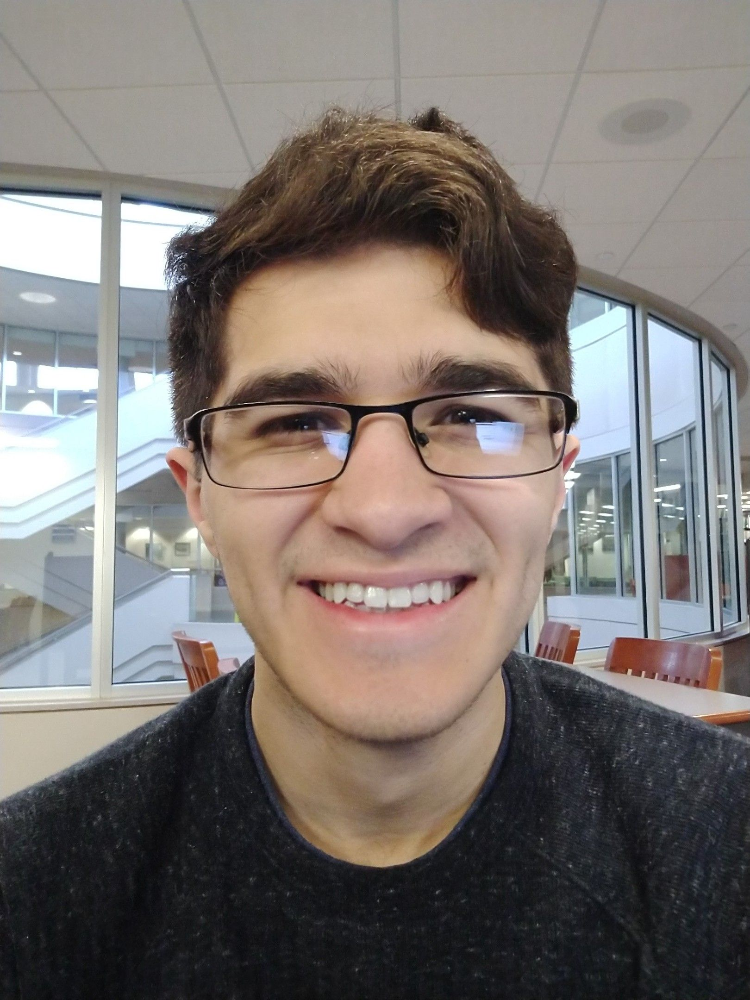
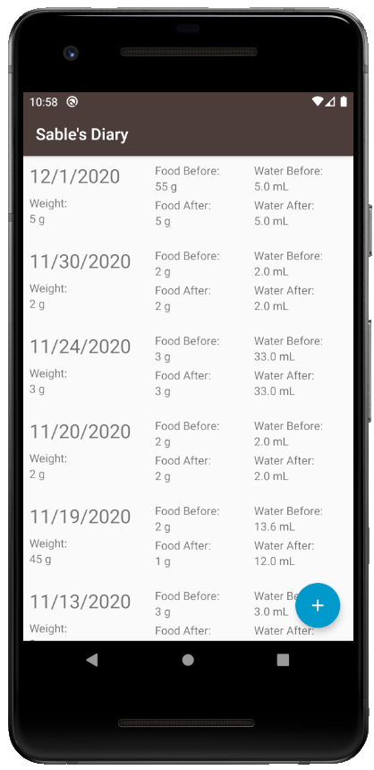
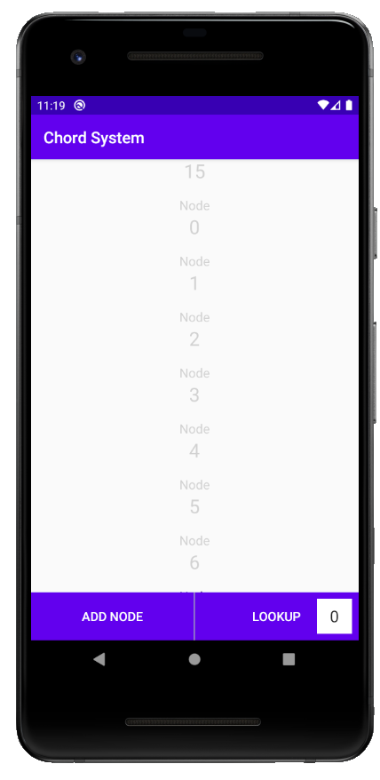
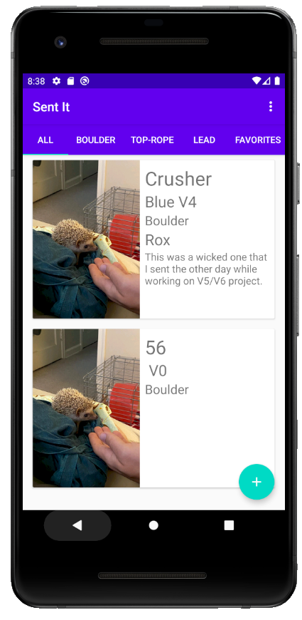

# Profile

Hello! My name is Michael Villarreal, and I am Computer Science PhD student at the University of Memphis. While I do have a variety of different interests, I focus mainly on machine learning and AI. My area of research right now is within the computer vision realm of machine learning as it relates to denoising autoencoders and creating robust models.

## Research

My current area of research focuses on using machine learning in computer vision tasks. More specifically, I am working on a project that involves using an autoencoder in order to improve steering angle predictions when the images used to predict those steering angles contain natural perturbations. I am researching trying to train the autoencoder to be robust while also have not too large of a training time.

As I am in my first semester of my PhD, I definitely have a lot to learn about research and want to research more and more topics to expand my horizons. One of my biggest areas of interest is Reinforcement Learning. I have done some studying on Reinforcement Learning and helped a bit with a RL project, but would like to do more and even have my own RL project.

## Android Applications

During the pandemic, I decided to pick up a new skill in order to improve my software development ability! Some of the projects listed below are the culmination of that.

### Sable's Diary

This one was both fun to make and provides a great utility for me, and it involves one of my favorite things: my hedgehog Sable! (Yes, she was named after the Animal Crossing character).

This Android app allows me to keep track of what my hedgehog eats and drinks on a daily basis. It allows me to put in the date on which the measurements were taken and allows me to put how much she weighs as well. Keeping track of this information is especially useful as hedgehogs can hide illnesses well and keeping track of this information can allow me to catch if any problems arise.

### Chord System

This app was a quick one that I did for a homework assignment in my Distributed Systems class. The goal of the homework was to code and demonstrate the Chord System.

Here is a link to the video I submitted to the professor explaining the app: [Video Link](https://youtu.be/XXWSQPFRaxk)

### Sent It

This was a personal project of mine that was inspired by one of my hobbies: climbing. I really love climbing, and I love climbing all sorts of routes with all sorts holds. Whether its crimps, slopers, jugs, slab, toe-hook, knee drop, etc., I will get on it and try to climb; however, one problem is that, in indoor climbing gyms, the route setters change the walls every so often. Because of this, I decided to code an app that would allow me to record the routes that I had climbed. The app allows me to name the route, record its grade, where I climbed it, and a description of it. It also allows me to take a picture of the route, which it uses as a thumbnail. I added the ability to record sending the route as well to the app, but this feature can be improved.

(The picture used as the thumbnail is a placeholder image for these examples. In the app, the user is required to take a picture of the route in order to save the route.)

### Project Task Manager

This Android application was developed for the course project in my Distributed Systems class. It is a simple and basic task manager. It allows users to login to a system that will list to them all of their projects. When a user selects a project, it will then show them their individual and group tasks and any pictures that relate to the project.

The main requirement for this project was that it had to involve a distributed system. I accomplished this within the app by utilizing Amazon Cloud Services. I used Amazon DynamoDB and Amazon S3 in order to store the information and pictures about each project within the cloud. I used them both together in order to make a small distributed database system.

Here is a link to me explaining the project that was submitted to my professor: [Video Link](https://youtu.be/xkxTWye2HJ0)

## Contact

Personal Email: tmichaelvillarreal@gmail.com

School Email: tmvllrrl@memphis.edu

